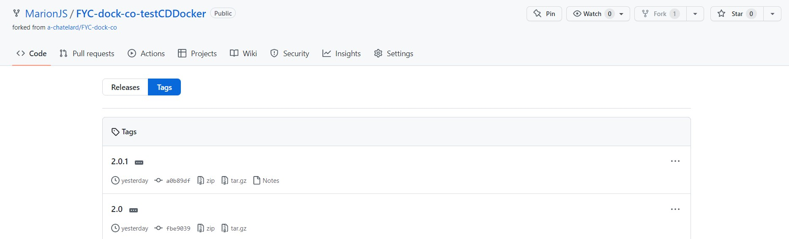
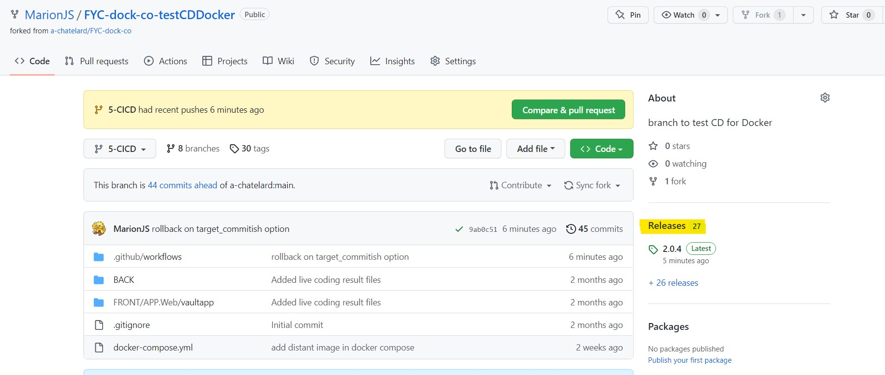
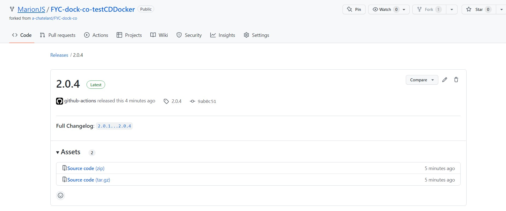

# CI/CD Partie 3 : release Github

## C'est quoi une release ?

Ça y est, après plusieurs commits sur votre répertoire Github, vous estimez que votre application est fonctionnelle et
livrable en production.  
Les tests que vous avez automatisés dans l'exercice précédent sont tous passés, maintenant les utilisateurs peuvent
récupérez votre code.

Comment leur indiquer le commit à récupérer ? Grâce à un ou plusieurs tag(s). Voyez ça comme un marque-page ou un gros
coup de surligneur dans un livre.   
Il permet d'identifier certains commits pour les utiliser par la suite.  
Vous allez peut-être vouloir donner plus d'informations à vos utilisateurs :

- quelles améliorations vous avez développées
- quels bugs ont été traités
- quel environnement est nécessaire pour lancer le projet
- etc

La combinaison du code à un instant t et des informations fournies devient alors une release, avec un numéro de version.
Ce numéro de version peut être identique à celui du tag.

La gestion des tags et des releases peut se faire manuellement sur Github, mais c'est une étape qu'on peut aussi
automatiser !   
Dans la pratique, vous ne voudrez surement pas générer de release à chaque commit.   
Selon votre projet et la façon dont vous travaillez, vous trouverez votre rythme de release et les règles à mettre en
place.

Mais dans notre cas nous allons partir sur une logique simple pour appréhender l'automatisation :

- on pousse un commit
- on build le code
- on teste le code
- on crée un nouveau tag et on l'attribue à ce commit
- on crée une release

## Exercice guidé sur le backend

Pour illustrer nos propos, nous allons maintenant rédiger l'étape de release sur Github dans notre workflow.

Prérequis :

- vous avez fait un fork du projet
- vous avez fait les exercices précédents qui permettent de créer les jobs de build et de test de l'application

### Etape 1 : récupérer le précédent tag

Pour incrémenter notre tag, nous devons connaitre le précédent numéro.  
**Cas particulier : il n'y a pas de précédent tag**  
Il faut bien un début à tout, et il en est de même pour les tags sur votre répertoire Github !   
Vous devez créer un premier tag manuellement. Il vous suffit de créer un tag avec la commande ``git tag <nom du tag>``,
et de le pousser sur votre répertoire distant avec ``git push --tags``.

Pour connaitre le numéro du tag précédent, nous n'allons pas utiliser de Github Action, mais simplement une ligne de
commande.

Allez sur votre workflow backend (workflow_backend.yml) et ajouter après le dernier step la ligne de commande suivante (
attention à l'indentation) :  
``- run: git fetch --depth=1 origin +refs/tags/*:refs/tags/*``.

Pousser vos modifications sur votre répertoire distant et allez ensuite dans l'onglet "Actions" pour vous assurer du bon
déroulement du workflow.

### Etape 2 : calcul de la nouvelle version

Nous utiliserons ici une [Github Action](https://github.com/jenkins-x-plugins/jx-release-version) qui va réaliser le
calcul du numéro de version suivant. En lisant la documentation vous pourrez voir qu'elle a beaucoup d'options
intéressantes, surtout pour choisir la façon dont vous allez incrémenter le numéro de version.

Allez sur votre workflow backend (workflow_backend.yaml) et ajouter après le dernier step la ligne de commande
suivante (attention à l'indentation) :  
```
- id: nextversion 
  name: next release version 
  uses: jenkins-x-plugins/jx-release-version@v2.6.1
```

**Avez-vous remarqué ?**
Ici nous avons donné un id à notre step. Cela va nous aider à exploiter la donnée calculée par la suite.

Pousser vos modifications sur votre répertoire distant et allez ensuite dans l'onglet "Actions" pour vous assurer du bon
déroulement du workflow. Si toutes les étapes se sont bien déroulées, vous devez voir un nouveau tag dans la liste des
tags de votre projet.



### Etape 3 : publication de la nouvelle release

Nous utiliserons une nouvelle [Github Action](https://github.com/softprops/action-gh-release) pour cette étape.

Dans la documentation, on peut voir plusieurs options intéressantes :

- generate_release_notes : va permettre de générer une release note automatiquement
- files : permet de fournir des fichiers dans la release (un executable, ou une documentation complète par exemple)
- fail_on_unmatched_files : permet de stopper le workflow si les fichiers ne sont pas trouvés pour la release
- tag_name : permet de définir un nom spécifique à notre tag
- target_commitish : permet de referencer un tag dans la release

N'hésitez pas à consulter la documentation de la Github Action pour découvrir les autres options afin d'optimiser vos
releases !
Dans notre cas, nous allons générer la release note automatiquement (generate_release_notes). Nous allons aussi
référencer le tag créé dans la release. De plus, nous allons imposer un nom pour le tag (tag_name). Si on laisse
l'option par défaut, la Github Action va prendre le *tag actuel* comme nom de tag.  
Mais il faut que le nom soit celui calculé dans le step précédent ! Vous vous rappelez l'id dont on a parlé plus
haut ? Grâce à cela on va appeler la variable ``steps.nextversion.outputs.version``.

Dans notre workflow nous allons donc saisir le step suivant :  
```
- name: Release 
  uses: softprops/action-gh-release@v1 
  with:
      tag_name: ${{ steps.nextversion.outputs.version }} 
      generate_release_notes: true 
      target_commitish: ${{ github.ref }}
```

Pousser vos modifications sur votre répertoire distant et allez ensuite dans l'onglet "Actions" pour vous assurer du bon
déroulement du workflow. Si toutes les étapes se sont bien déroulées, vous devez voir un nouveau tag sur la page
principale de votre projet.





## A vous de jouer ! 

Vous devez maintenant réaliser les mêmes étapes sur votre workflow front.
Ne vous précipitez pas et pousser votre commit à chaque step pour identifier les potentiels problèmes !

La correction se fera en vidéo à la fin de l'étape suivante. 