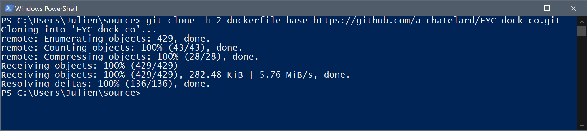
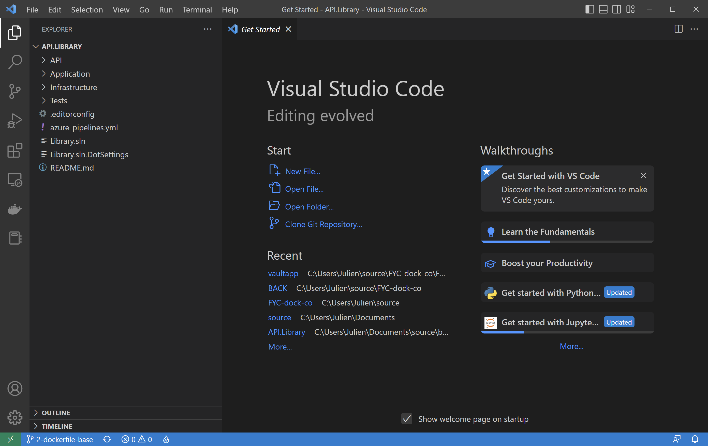
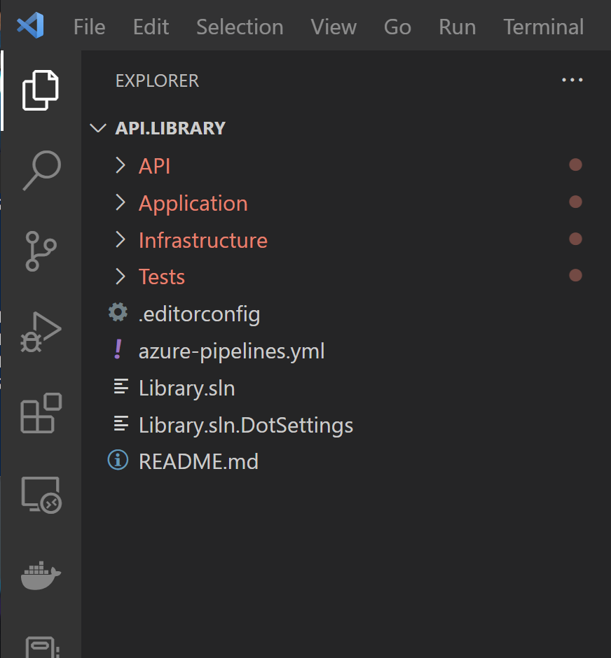
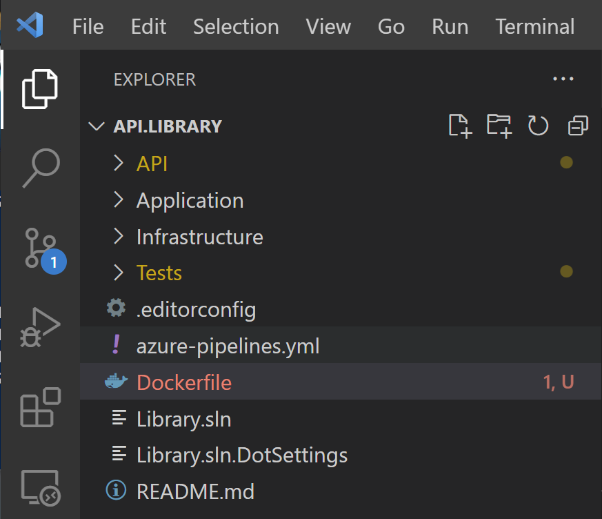
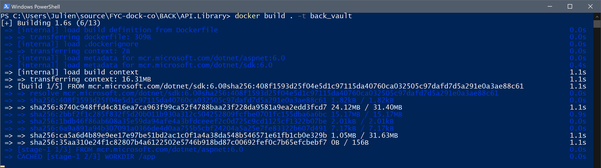

## Exercice accompagné : Dockerfile d'une application Back-end

&nbsp;

Après avoir vu la syntaxe et les instructions des Dockerfile, et après avoir abordé le cache de Docker et le système par couche des images, il est temps de s’exercer un peu avec un cas pratique ! 

Dans cet exercice accompagné, nous allons créer de A à Z un Dockerfile qui nous permettra de créer une image Docker de notre application : une API Web qui fait office de Back-End dans notre solution.

&nbsp;

### 1) Avant de commencer

&nbsp;

Avant tout chose, il nous faut récupérer les sources du projet : notre application Back-End. La solution complète comprend une partie Back-End et une partie Front-End, mais nous n'allons pas nous occuper de la partite Front-End pour le moment.

Le projet est disponible à l'adresse suivante : https://github.com/a-chatelard/FYC-dock-co/tree/2-dockerfile-base

&nbsp;

Nous devons cloner le dépôt pour récupérer les sources. Placez vous dans le dossier de votre choix et clonez le dépôt git avec la commande suivante :
```
git clone -b 2-dockerfile-base https://github.com/a-chatelard/FYC-dock-co.git
```

&nbsp;



&nbsp;

Après avoir cloné le dépôt sur notre machine, nous pouvons passer à la création de notre premier Dockerfile !

&nbsp;

### 2) Création du Dockerfile 

&nbsp;

Comme expliqué précédemment dans ce cours, tout éditeur de texte peut faire l'affaire pour créer un fichier Dockerfile. Néanmoins il y a une solution à la fois gratuite et légère, qui offre une bonne intégration de Docker, et c'est la solution que je vous propose pour créer ce premier Dockerfile : nous allons utiliser Visual Studio Code.


Vous pouvez vous placer directement dans le dossier de l'application Back-end afin de l'ouvrir dans VS Code. Voici le chemin du dossier en question :

``/dossier_du_depot_git/BACK/API.Library``

&nbsp;



&nbsp;

Voici les éléments qui devraient s'afficher dans votre explorateur de fichier VS Code si vous vous êtes placé dans le bon dossier :

&nbsp;



Certains éléments apparaissent en rouge dans l'explorateur, ce qui est synonyme d'erreur. Pas d'inquiétude cependant, ces erreurs ne nous gênerons pas pour la création de notre Dockerfile !

&nbsp;

Si toute fois vous souhaitiez absolument corriger ces erreurs, il suffit d'ouvrir un terminale et de taper la commande suivante : dotnet restore

&nbsp;

Il ne nous reste plus qu'à créer un fichier que vous nommerez sobrement Dockerfile (pour rappel le fichier ne doit pas utiliser d'extension).



&nbsp;

Nous pouvons passer à la partie la plus intéressante de cet exercice : les instructions du Dockerfile !

&nbsp;

### 3) Des instructions pour notre Dockerfile

&nbsp;

Qu’allons-nous mettre dans notre Dockerfile ? Si vous avez bien suivi le cours, vous savez que tous les Dockerfile commencent par une instruction ``FROM`` : elle nous permet de spécifier l’image de base pour notre projet.

Nous allons récupérer une image du SDK (Software Development Kit) du framework .NET 6. Le SDK va nous permettre de compiler notre projet. 

&nbsp;

Voici l'instruction à placer tout en haut de votre Dockerfile :
```
FROM mcr.microsoft.com/dotnet/sdk:6.0 as build
```
Vous avez remarquer à la fin le "as build" ? cet option nous permet de donner un nom à cet image "temporaire". Ce nom nous permettra de manipuler cette image plus loin dans le Dockerfile.

&nbsp;

Ensuite nous allons faire appel à l'instruction ``WORKDIR`` pour spécifier le chemin qui sera utilisé pour les commandes suivantes.
```
WORKDIR /var/tmp
```

&nbsp;

Il est temps de copier les sources du projet et de compiler ce dernier afin d’obtenir la version exécutable de notre application !
```
COPY . ./
```

Si vous avez bien suivi, l’argument ``.`` qui permet d’indiquer le dossier courant va nous permettre de copier tous les éléments présents dans le dossier où se trouve actuellement notre Dockerfile (en l’occurrence, il s’agit du dossier API.Library). Les éléments copiés vont être ajoutés à l’image Docker à l’emplacement indiqué, c’est-à-dire l’emplacement courant dans l’image. Il s’agit du dossier ``/var/tmp``, puisque c’est l’emplacement que nous avons indiqué avec l’instruction ``WORKDIR`` !

&nbsp;


```
RUN dotnet restore
RUN dotnet publish -c Release -o out
```

Les deux instructions ``RUN`` permettent d’exécuter des commandes dans le shell de l’image Docker. La première permet de restaurer les dépendances de notre projet.

&nbsp;

La commande ``dotnet publish -c Release -o out`` nous permet de publier (compiler) notre application en mode release, l’option ``-o`` spécifie le dossier dans lequel enregistrer tous les fichiers créés par l'étape de compilation. (Ces commandes sont spécifiques aux projets .NET, elles ne seraient d'aucune utilité pour tout autre type de projet, comme une application écrite en Java ou en Go.)

&nbsp;

Que faire ensuite ? nous avons une image qui contient la version publiée de notre application, mais est-ce suffisant pour créer un conteneur ? Il nous manque encore quelques éléments pour arriver au résultat souhaité.

Nous allons maintenant récupérer une nouvelle image, il s’agit du runtime .NET 6 qui nous servira à exécuter notre application dans notre futur conteneur !
```
FROM mcr.microsoft.com/dotnet/aspnet:6.0
```

&nbsp;

Nous allons changer le répertoire de travail et nous allons copier le résultat de la commande dotnet publish dans un nouveau dossier :

```
WORKDIR /app
COPY --from=build /var/tmp/out ./
```

Avez-vous remarqué l’option ``–from`` dans l’instruction ``COPY`` ? Elle nous permet de récupérer des fichiers à partir d’une autre image, la première que nous avons intégré dans le Dockerfile. Avec la 2ème instruction ``FROM``, nous avons changer d’image, celle-ci possède un système de fichier qui n’est pas partagé avec celui de la première image, celle qui est basée sur le SDK !

Heureusement l’instruction ``COPY`` nous permet de récupérer des fichiers depuis une autre image. Nous allons récupérer uniquement les éléments présents dans le dossier ``/var/tmp/out``, souvenez-vous il s'agit du résultat de la compilation de notre application. De fait dans la version finale de notre image Docker, il ne restera que la version compilée de notre application, et non l’intégralité des fichiers du projet.

&nbsp;

Nous arrivons à la fin, il nous reste à définir la commande que le conteneur devra exécuter pour démarrer notre application, à la création du conteneur et après chaque redémarrage de ce dernier. Quelle instruction va nous venir en aide cette fois-ci ? L’instruction ENTRYPOINT :

```
ENTRYPOINT ["dotnet", "Library.API.dll"]
```

&nbsp;

### 4) Version finale du Dockerfile

&nbsp;

Voici à quoi devrait ressembler votre Dockerfile :


```
FROM mcr.microsoft.com/dotnet/sdk:6.0 as build
WORKDIR /var/tmp
 
COPY . ./
RUN dotnet restore
RUN dotnet publish -c Release -o out
 
FROM mcr.microsoft.com/dotnet/aspnet:6.0
WORKDIR /app
COPY --from=build /var/tmp/out ./
ENTRYPOINT ["dotnet", "Library.API.dll"]
```

Sauvegardez votre fichier. Il temps désormais de créer notre image Docker, et de créer un conteneur à partir de cette image !

&nbsp;

Comment créer une image ? C’est la commande ``docker build`` qui va nous être utile ici.

A l'aide d'un terminal, placez-vous dans le répertoire où se trouve votre Dockerfile et exécutez la commande suivante :
```
docker build . -t back_vault
```

Ici nous donnons le tag "back_vault" mais n'importe quel autre nom fera l'affaire.



&nbsp;

La commande docker run nous permet de créer un conteneur à partir de notre image nouvellement créer. (si vous avez changer le tag associé à votre image dans le commande précédente, il faut changer le tag à la fin de la commande docker run avec celui que vous avez choisi.)
```
docker run -d -p 5000:5000 back_vault
```

&nbsp;

L'application écoute sur le port 5000 ; pour vérifier que tout c'est bien passé, vous pouvez ouvrir un navigateur et tenter d'accéder au conteneur à l'adresse suivante :

``http://localhost:5000/swagger/index.html`` 

&nbsp;

Vous devriez arriver sur l'interface Swagger de l'API qui s'exécute dans le conteneur.

&nbsp;


&nbsp;

Félicitations ! Vous venez de créer votre premier Dockerfile et votre première image Docker.

Dans l'exercice suivant, vous allez devoir créer une image Docker pour la partie Front-End de la solution présentée dans ce cours. Cette fois vous devrez vous débrouiller seul pour concevoir le Dockerfile.

&nbsp;

&nbsp;

## Exercice : Dockerfile d'une application Front-end

&nbsp;

Voici un nouvel exercice pour vous entraîner à l'écriture de fichier Dockerfile : vous allez écrire un nouveau Dockerfile pour notre application Front-end !

&nbsp;

Pour ce faire vous aurez besoin de récupérer les sources du projet (si ce n'est pas déjà fait) et créer un nouveau Dockerfile pour l'application Front-End.

Le projet Front-end est une application web développée avec Angular, vous aurez donc besoin de compiler le projet en ligne de commande. Voici un lien vers la documentation https://angular.io/cli.

&nbsp;

Vous aurez également besoin d'une image avec node.js, pour compiler le projet, et une autre image avec un server web. Voici deux images qui peuvent convenir :

- [nginx/alpine](https://hub.docker.com/_/nginx)

- [node/alpine](https://hub.docker.com/_/alpine)

&nbsp;

Voici en vidéo la correction de cet exercice :

https://www.youtube.com/watch?v=mUtrUlorh-A&t=5s

&nbsp;

&nbsp;

## Dockerfile : base de données

&nbsp;

Pour la base de données, nous vous demandons juste de créer un fichier nommé Dockerfile (sans extension) dans le répertoire BACK/SQL.Scripts du projet.

&nbsp;

Dans ce fichier, écrivez les instructions suivantes : 

```
FROM mcr.microsoft.com/mssql/server:latest

ARG A_SA_PASSWORD=@Password123
ARG A_ACCEPT_EULA=Y

ENV SA_PASSWORD ${A_SA_PASSWORD}
ENV ACCEPT_EULA ${A_SA_PASSWORD}

ENV MSSQL_PID Developer
ENV MSSQL_TCP_PORT 1433

WORKDIR /var/tmp

COPY vault_library_create_database.sql ./vault_library_create_database.sql
COPY vault_library_create_tables.sql ./vault_library_create_tables.sql

RUN (/opt/mssql/bin/sqlservr --accept-eula & ) | grep -q "Service Broker manager has started" && /opt/mssql-tools/bin/sqlcmd -S 127.0.0.1 -U sa -P ${A_SA_PASSWORD} -i vault_library_create_database.sql && /opt/mssql-tools/bin/sqlcmd -S 127.0.0.1 -U sa -P ${A_SA_PASSWORD} -i vault_library_create_tables.sql
```

&nbsp;

Sauvegardez le fichier.
Ouvrez un terminal et placez vous dans le dossier parent du Dockerfile.
Vous pouvez maintenant créer une image de la base de données avec la commande  : 
docker build -t bdd_vault .
En ligne de commande, listez les images présentes en local pour vérifier la création de cette nouvelle image.

&nbsp;

Pour lancer cette image, saisissez la commande suivante : 
```
docker run -d -p 1433:1433 --name sql-server bdd_vault
```

&nbsp;

Vous pouvez vérifier qu'un conteneur est créé en listant les conteneurs présents en local sur votre machine.

&nbsp;