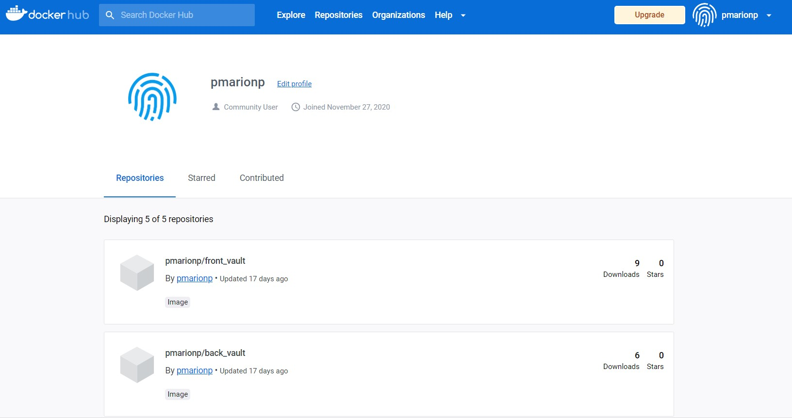

# Partie 4 : Docker Hub

## C'est quoi Docker Hub?

Docker hub est un service fourni par Docker pour trouver et partager des images. C'est le plus grand répertoire d'
images, et il en contient de toutes sortes :   
communautés de développeurs, projets open source et vendeurs indépendants de logiciel vont y construire et distribuer
leur code grâce à des conteneurs.

Le Docker Hub vous permet de stocker et de récupérer des images (push et pull).

Certaines images sont certifiées par Docker, prenez les en priorité pour forger vos images, car vous êtes assurés
qu'elles sont bien documentées, qu'il y a des bonnes pratiques à suivre et des explications pour mettre en place l'image
sur votre Docker.  

  

Les images officielles sont généralement des outils de base (OS, base de données, langages de programmation) qui vont
servir de base pour beaucoup d'utilisateurs. Ces images sont maintenues et des mises jour de sécurité sont réalisées
régulièrement.

Des équipes Docker sont dédiées à la vérification et la publication d'images officielles, en collaboration avec des
développeurs, des experts sécurité et la communauté Docker.  
Si l'open-source vous intéresse, de nombreuses issues sont ouvertes sur Github et n'attendent que vous !

Des badges "Verified publisher" sont aussi délivré pour des contenus certifiés de haute qualité fournis par des éditeurs
externes faisant partie du programme Docker Verified Publisher.

## Comment accéder à votre espace Docker Hub

Si vous n'avez pas créé de compte Docker à l'installation, veuillez le faire maintenant !

Vous pouvez ensuite accéder à votre espace de stockage sur Docker Hub.

Vous pouvez avoir accès à des répertoires publics gratuits pour stocker vos images. Si vous choisissez d'avoir des
répertoires privés, vous devrez payer un abonnement à partir de 2 répertoires privés.

Pour notre exercice, nous allons reprendre les DockerFile de votre base de données, de votre backend et de votre front
et les pousser dans votre Docker Hub.  
Placez-vous sur la
branche ["2-dockerfile-td" du Github](https://github.com/a-chatelard/FYC-dock-co/tree/2-dockerfile-td/) pour accéder aux
Dockerfile complets.

Commençons avec la base de données. Placez-vous dans le dossier contenant le DockerFile de l'image base de données et
exécutez la commande docker :   
``docker build -t <votre_username>/bdd_vault <path du dossier contenant le dockerfile>``.

Poussez ensuite votre image sur votre Docker Hub en utilisant la commande `` docker push <votre_username>/bdd_vault `` .

Vous pouvez ensuite consulter votre DockerHub et constater l'apparition de l'image <votre_username>/bdd_vault !  
Cliquez sur l'image et complétez la documentation pour ne pas oublier les commandes pour lancer votre conteneur, avec
tous les paramètres obligatoires (comme le nom pour la base de données !) et ceux optionnels.  
Vous pouvez prendre exemple sur la documentation de
l'image [pmarionp/bdd_vault](https://hub.docker.com/r/pmarionp/bdd_vault).

## Quizz

### Les images stockées sur le Docker Hub
* sont toutes certifiées par Docker (F)
* peuvent être certifiées par Docker (V)
* ne sont que des images créées par Docker Inc. (F)

### Les images certifiées sont (plusieurs réponses possibles)
* vérifiées par des équipes dédiées de Docker Inc. (V)
* vérifiées par la communauté (V)
* payantes (F)

### Docker Hub
* Est totalement gratuit (F)
* Est toujours payant (F)
* Fonctionne avec un abonnement au bout d'un certain nombre de registres privés (V)

### Pour pousser une image sur Docker Hub (plusieurs réponses possibles)
* Vous devez avoir un compte Docker Hub (V)
* Le nom de votre image doit être de forme <username>/<image name> (V)
* Vous pouvez spécifier un tag à votre image (V)

