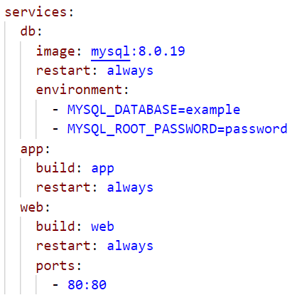
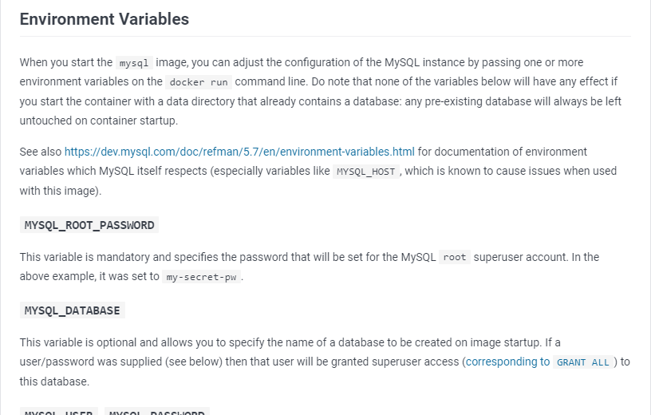

# Introduction à Docker compose

Dans le chapitre précédent, nous avons appris à prendre en main et à utiliser les fichiers Dockerfile afin de définir des images docker que nous pouvons lancer et arrêter à notre guise.  
Ces fichiers permettent notamment de configurer de manière plus poussée notre image avant de pouvoir l'utiliser.  

Cependant, dans le cadre de la gestion d'une solution comprenant de nombreux services interdépendants, il sera nécessaire de créer plusieurs fichiers Dockerfile représentant chacun une image Docker que l'on pourra définir et paramétrer.
Un problème intervient donc quant à l'orchestration de ces derniers. En effet, il n'est pas envisageable de lancer l'ensemble des conteneurs un à un manuellement et des problèmes peuvent intervenir si nos différents conteneurs doivent communiquer ensemble.
La gestion des volumes et des réseaux docker peut également devenir problématique dans un environnement non orchestré.  

Se dégage donc une problématique commune de besoin d'orchestration de l'ensemble des conteneurs d'une solution.  
Et pour répondre à cette problématique, la plateforme docker a travaillé à la création d'un outil qui permet une orchestration simple s'appuyant sur une syntaxe standardisée nommée **Docker Compose**.  

.jpg) 

# Orchestration avec Docker compose

Docker compose est un outil d'orchestration s'appuyant sur l'environnement Docker permettant de définir un ou plusieurs services au sein d'un même fichier.  

Cet outil présente de nombreux avantages :

- une configuration simplifiée des services et de leurs dépendances,
- une orchestration de l'ensemble de nos services via un point d'entrée unique,
- une portabilité adaptée à la gestion des environnements et du déploiement (CI/CD),
- une configuration complète d'une solution à portée de main via une simple commande

## Un peu d'histoire
Lors de la création de Docker en 2014, aucun outil permettant l'orchestration de plusieurs conteneurs n'avait encore été développé.  

On voyait donc apparaitre les premières problématiques d'orchestration dues aux commandes docker run interminables.  

Pour répondre à ces problématiques, le CEO et CTO de la petite firme Orchard avaient créé un outil nommé Fig, le premier système d'orchestration de conteneurs mais également l'ancêtre de Docker Compose.

Docker voit en Fig une belle opportunité afin d'accélérer leur objectif d'offrir une plateforme ouverte permettant le build, le ship et l'exécution d'applications distribuées.  

Orchard Laboratories Ltd sera racheté par l'entreprise Docker et les deux créateurs de Fig seront recrutés en son sein.

On retrouve d'ailleurs grande similitude entre la syntaxe originelle de Fig et la syntaxe actuelle de docker-compose.  

## Fonctionnement
Docker compose s'appuie sur l'utilisation d'un fichier au format **YAML** dans lequel nos différents services seront définis.  

Ces services sont représentés par des images Docker qui peuvent être définies soit directement dans le fichier compose, soit via un fichier Dockerfile, soit dans le Dockerhub dont nous parlerons plus tard dans cette formation.

*Le fichier de configuration de Docker Compose se base sur le standard "Compose" d'où le nom de l'outil. [Voir Compose Spec](https://compose-spec.io/)*  

5 types d'éléments distincts peuvent être déclarés dans un fichier Docker Compose :

- **Des services**, représentants nos différentes ressources applicatives définies via une image Docker. Un fichier docker-compose doit déclarer au moins 1 service. Il existe de nombreuses clés de configuration pour un service. Nous en étudierons plusieurs dans la suite de cette formation.
- **Des réseaux**, permettant la communication entre plusieurs services. Il existe un réseau par défaut via lequel tous les services pourront communiquer. Lorsque deux services sont présents sur un même réseau, il est possible de communiquer d'un service à l'autre en utilisant le nom du service défini dans le fichier compose ainsi que le port.
- **Des volumes**, dans lesquels nos différents services pourront stocker des données persistantes sur la machine hôte. Chaque service peut définir ses propres volumes de persistance. Mais il est également possible de partager un volume entre plusieurs services (pour instaurer un système de backup par exemple).
- **Des configuration**s afin que les services puissent adapter leurs comportements sans nécessiter une reconstruction de l'image Docker.
Une configuration peut être un fichier présent dans la solution ou une ressource externe (voir Docker Configs)
- **Des secrets** pour sécuriser les informations sensibles nécessaires au bon fonctionnement (telles que des certificats, des accès à une base de données, etc...).
De la même manière que les configurations, les secrets peuvent être définis dans un fichier au sein de la solution ou en tant que ressource externe (voir Docker Secrets)  

  

Vous pouvez noter dans l'image ci-dessus la présence d'une "version". Cette dernière représente la version de la syntaxe Compose utilisée.  
Dans la dernière version de Compose, cette annotation est optionnelle et nous n'utiliserons pas d'ancienne version dans les travaux pratiques qui suivent.  
Notez cependant que si vous mettez à niveau votre version du fichier compose, des risques d'incompatibilités et des évolutions peuvent apparaitre sur certaines options (voir [Docker Compose Versionning](https://docs.docker.com/compose/compose-file/compose-versioning/)).  

Dans la leçon suivante, nous allons nous pencher sur la syntaxe du fichier docker compose et commencerons notre premier TP. 

# Prise en main et utilisation du fichier compose.yaml

## Prise en main du fichier docker compose
Dans ce chapitre nous allons nous pencher sur la syntaxe d'un fichier docker compose afin de la prendre en main pour ensuite rédiger notre premier fichier docker compose dans une séance de live coding.  

Réutilisons le fichier docker compose exposé dans le chapitre précédent :  

    

On remarque premièrement la présence de trois services : **db, app** et **web**. Pour rappel, un fichier compose doit obligatoirement comprendre au moins un service.  
Le service db par exemple, est défini par une [image mysql présente sur le docker hub](https://hub.docker.com/_/mysql). Sa version est définie à 8.0.19 mais il est également possible d'utiliser la dernière version d'une image docker hub en utilisant l'attribut latest soit *mysql:lastest*.  

Ce service comprend également deux paramètres : *restart et environment*.  

Le paramètre restart permet de définir le comportement du service en cas d'arrêt.  
Il existe 5 options possibles pour ce paramètre :

- **no**, l'option par défaut : le service ne se relancera pas en cas d'arrêt,
- **always** : le service se relancera toujours en cas d'arrêt,
- **on-failure** : le service ne se relancera qu'en cas d'erreur, c'est à dire que le service s'est arrêté avec un code indiquant une erreur,
- **unless-stopped** : le service relancera toujours à part s'il a été arrêté manuellement (via une commande ou l'interface docker desktop par exemple)  

Chaque option est très spécifique et adaptée à un cas précis. Par exemple, veut-on qu'un service possédant une faille critique se relance tout seul lorsqu'il est arrêté ?
Dans un environnement où des incertitudes concernant un service sont présentes, utiliser la valeur par défaut est l'option la plus sûre.

Pour aller plus loin, si vous souhaitez définir des règles plus poussées durant le déploiement de votre service via docker compose, vous pouvez également regarder le paramètre *[restart_policy](https://github.com/compose-spec/compose-spec/blob/master/deploy.md#restart_policy)*.  

Le second paramètre **environment** permet lui de définir les différentes variables d'environnement définies sur le conteneur docker sous-jacent à l'image.  
Les variables d'environnement utilisées dans un conteneur sont fortement liées à l'image concernée. Ici, l'image utilisée est une image Mysql, on retrouve donc deux des variables d'environnement utilisées par mysql.  

Notez que les variables d'environnement de la plupart des images présentes sur docker hub seront listées et documentées. Par exemple pour mysql on retrouve les deux variables utilisées : 

    

Si l'on regarde le service **web**, on remarque deux nouveaux paramètres : **build** et **ports**.

Le paramètre **build** est une alternative au paramètre **image** dans le sens où les deux permettent de définir comment l'image du service concerné sera définie.  
Cependant, le paramètre build permet de définir l'image du service en s'appuyant sur une fichier Dockerfile, là où le paramètre **image** s'appuie sur une image présente sur un [registry docker](https://docs.docker.com/registry/) tel que Docker hub.  

Dans notre exemple, ce paramètre induit la présence d'un fichier **Dockerfile** dans le répertoire **/web** contenant la définiton de l'image du service. Si jamais le paramètre **build** est défini mais qu'aucun fichier Dockerfile n'est présent dans le dossier indiqué, une erreur sera soulevée.  

Notez que les paramètres **build** et **image** peuvent tous les deux être présents dans un service. Dans ce cas précis, le paramètre **build** définira toujours l'image qui sera créée tandis que le paramètre **image** définira son nom. Cela peut-être utile si l'on souhaite pousser l'image sur un registry docker.  

Enfin on observe la présence du paramètre **ports**. De la même manière que dans un fichier Dockerfile ou dans une commande docker run, le paramètre port permet d'exposer et de rediriger si besoin les ports utilisés par notre service. Ici, notre image **web** comprend un service qui utilise le port 80 et ce dernier est redirigé sur le même port sur la machine hôte.  

Nous avons globalement pu découvrir la syntaxe d'un fichier docker compose. Il existe bien sûr de nombreux autres paramètres utilisables ayant chacun une utilité particulière. N'hésitez pas à consulter la [documentation de la spécification Compose](https://github.com/compose-spec/compose-spec/blob/master/spec.md) si vous souhaitez en apprendre plus sur les différents paramètres possibles.

Pour l'instant, nous allons nous contenter des paramètres vus dans ce chapitre et aurons l'occasion d'en découvrir d'autres durant la session de live coding.  

## Commandes docker compose
Plusieurs commandes accompagnent l'utilisation de docker compose afin de gérer l'ensemble de nos services. Ces commandes doivent être exécutées à l'endroit où se trouve le fichier docker compose.  
Nous allons passer rapidement sur ces commandes pour comprendre globalement leur utilité.  

=> Notez que pour la plupart de ces commandes, il est possible d'ajouter le nom d'un ou plusieurs services présents dans le fichier compose afin d'exécuter la commande seulement pour ce ou ces services. Si aucun service n'est indiqué la commande sera appliquée à l'ensemble des services.  

_[> docker compose build [services]](https://docs.docker.com/engine/reference/commandline/compose_build/)_  
Construire ou reconstruit les différents services. Les images créées sont ensuite consultables via la commande docker image ls.

_[> docker compose up [services] [-d]](https://docs.docker.com/engine/reference/commandline/compose_up/)_  
Construit, crée et lance les conteneurs pour les différents services. L'option "--detach" ou "-d" permet de lancer les conteneurs en mode détaché, c'est à dire en arrière-plan.

_[> docker compose stop / restart [services]](https://docs.docker.com/engine/reference/commandline/compose_stop/)_  
Permet d'arrêter / redémarrer un service.

_[> docker compose pause / unpause [services]](https://docs.docker.com/engine/reference/commandline/compose_pause/)_  
Permet d'interrompre un service. À la grande différence de la commande stop, pause utilise le signal linux SIGSTOP qui permet d'interrompre les processus. Tandis que stop utilise les signaux SIGTERM et SIGKILL qui arrête la machine linux liée au conteneur.

_[> docker compose down [services]](https://docs.docker.com/engine/reference/commandline/compose_down/)_  
Interrompt et supprime les conteneurs, images, réseaux et volumes générés par la commande up

_[> docker compose rm [services]](https://docs.docker.com/engine/reference/commandline/compose_rm/)_  
Supprime les conteneurs de services interrompus.

_[> docker compose ps](https://docs.docker.com/engine/reference/commandline/compose_ps/)_  
Liste les conteneurs compris dans le projet compose.

_[> docker compose ls](https://docs.docker.com/engine/reference/commandline/compose_ls/)_  
Liste les projets compose en cours d'exécution sur la machine hôte.   

Nous aurons l'occasion de voir plus en détails le résultat obtenu pour chacune de ces commandes durant la session de live coding.

