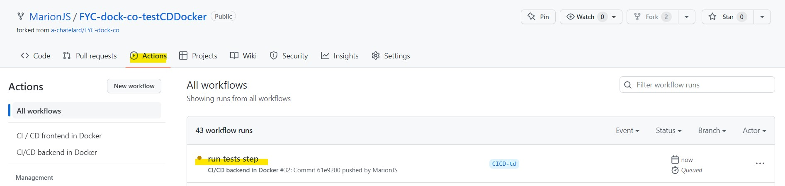
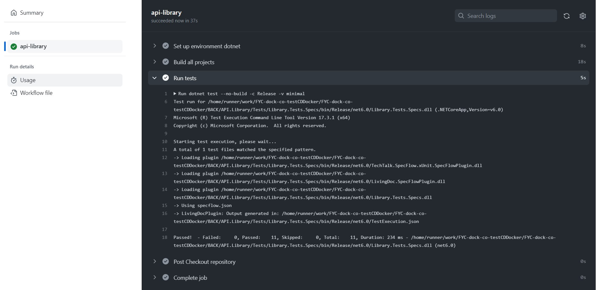

#Exercice accompagné : mise en place des tests

Grâce au workflow backend mis en place vous pouvez, à chaque commit sur votre branche, lancer un build de l'application afin de vous assurer du fonctionnement du code.


Dans cette prochaine étape, nous allons maintenant automatiser la phase de tests de l'application. Ainsi, à chaque fois que vous pousserez une modification sur l'application backend, les tests seront exécutés dans le workflow.


Ces deux étapes (build et tests) sont les premiers pas d'un workflow, et elles peuvent être mises en place dès le début d'un projet !

Pour réaliser le step de test de l'application, vous avez deux possibilités :

vous éxécutez une ligne de commande (elle est assez courte)
vous recherchez une Github Action dans le Marketplace ([celle ci par exemple](https://github.com/marketplace/actions/dotnet-tests))


Nous allons partir sur la première option : la ligne de commande.

Vous pourrez revenir essayer une Github Action en seconde intention si vous le souhaitez !

Nous allons lancer les tests unitaires (`dotnet test`) :

sans refaire de build (`--no-build`)
sur la configuration Release (`-c Release`)
un niveau d'informations minimum (`-v minimal`) : erreurs, warnings, évenements de haute importance et un résumé du build


Allez dans votre workflow (workflow-backend.yaml) et saisissez le prochain step (attention à l'indentation):

```
- name: Run tests
  run: dotnet test --no-build -c Release -v minimal
  shell: bash
```


Poussez vos modifications sur votre répertoire distant Github et allez ensuite dans l'onglet "Actions" pour vous assurer du bon déroulement du workflow.




Si vous n'avez pas touché au code de l'application nous avons fourni des tests fonctionnels ! 

