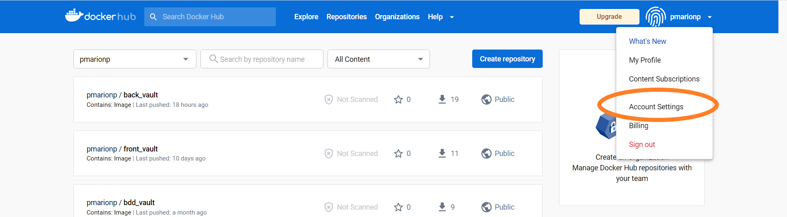
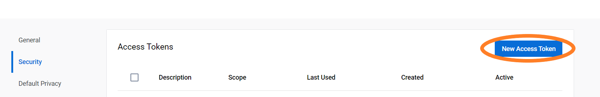
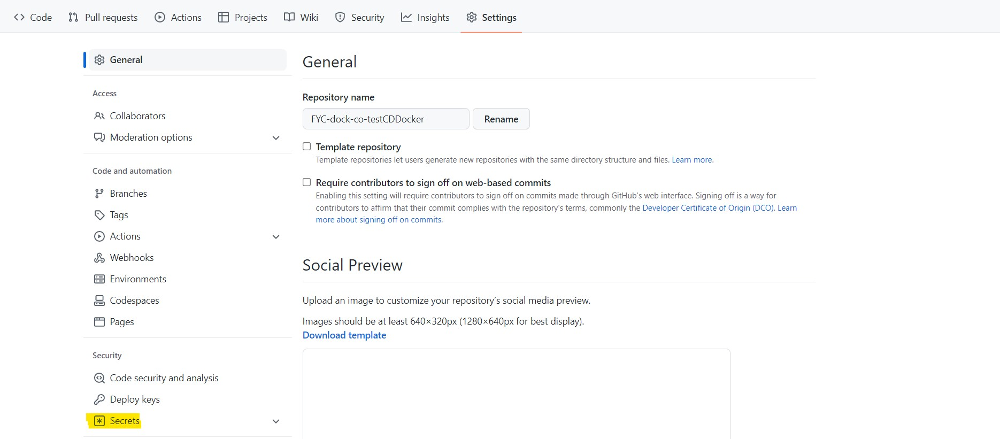
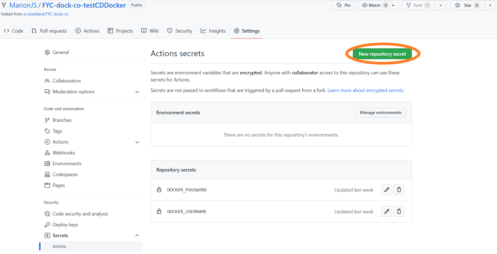
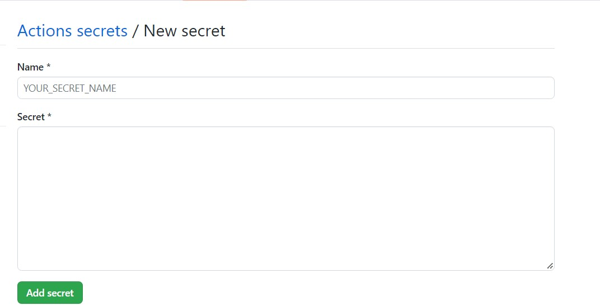
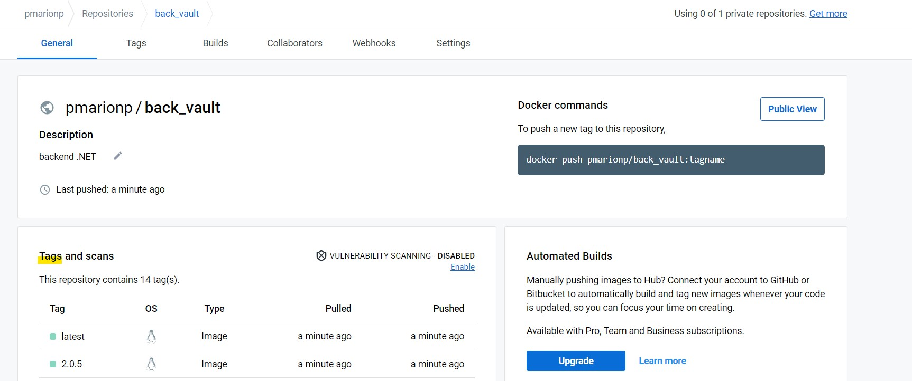

# CI/CD Partie 4 : nouvelle image DockerHub


Petit retour en arrière : dans la partie DockerHub, nous avons mis à jour le docker-compose.yaml en remplaçant les images
locales par des images distantes. Grâce à ça, quand un utilisateur veut lancer l'application N-tiers, il n'a plus qu'une
seule commande à exécuter (``docker compose up``), et il n'a plus à forger des images locales à la main.  

Maintenant que nous avons mis à jour notre code et que nous avons fait une release sur Github, il faut mettre à jour
les images distantes sur Docker Hub.   Ainsi, les updates réalisés sur l'application ne demandent pas de commande
supplémentaire à l'utilisateur. Il fera toujours uniquement un ``docker compose up``, qui ira chercher l'image qui porte le tag ``latest``.  

## Générer un token d'identification sur Docker Hub

Nous allons avoir besoin d'un token d'identification pour la suite de notre workflow sur Github. 
Allez dans les paramètres utilisateur et allez dans Account Settings.  

  


Allez ensuite dans Security et cliquez sur "New Access Token"  
  


Nommez ensuite votre token ("tokenForGithubAction" par exemple) et cliquez sur "Generate".  

**Copiez le token généré et conservez-le bien, nous allons en avoir besoin juste après !**  

## Exercice accompagné sur le backend

Nous allons maintenant rédiger l'étape de publication d'une nouvelle image sur le Docker Hub dans notre workflow.  

Prérequis :

- vous avez fait un fork du projet
- vous avez fait les exercices précédents qui permettent de créer les jobs de build, de test et de release de l'application

### Etape 1 : s'identifier sur Docker Hub

Vous devez être identifié sur Docker Hub pour pouvoir pousser une image. Comme nous automatisons cette étape, c'est une 
[Github Action](https://github.com/docker/login-action) qui va devoir se connecter.  
Cette Github Action a deux options : 
- username : votre nom d'utilisateur Docker Hub
- password : votre mot de passe 

Pour éviter de publier des données aussi sensibles, nous allons utiliser des variables d'environnement cryptées : les Secrets de Github. 

Allez dans les paramètres du projet que vous avez forké, cliquez sur "Secrets" puis "Action secrets". 
  



Cliquez sur "New Repository Secret" pour créer une nouvelle variable d'environnement cryptée.  

  

Renseignez le nom du secret : "DOCKER_USERNAME", et le secret (ici votre nom d'utilisateur sur Docker Hub). Une fois les informations saisies cliquez sur "Add secret".
Si vous voulez modifier ou supprimer ce secret, vous en avez la possibilité, mais vous ne pouvez pas consulter le secret que vous avez enregistré.  

Créez un second secret, nommez le "DOCKER_PASSWORD", et renseignez dans le secret votre token d'identification Docker Hub. 


Vous pouvez maintenant retourner dans le fichier workflow-backend.yaml et saisir le prochain step :  
```
- name: Log in to Docker Hub
        uses: docker/login-action@v2
        with:
          username: ${{ secrets.DOCKER_USERNAME }}
          password: ${{ secrets.DOCKER_PASSWORD }}
```

Poussez vos modifications sur votre répertoire distant Github et allez ensuite dans l'onglet "Actions" pour vous assurer du bon
déroulement du workflow.  

### Etape 2 : créer une image Docker et la pousser dans votre Docker Hub  

Maintenant que vous êtes identifié, vous allez pouvoir mettre à jour votre image sur Docker Hub.  
Pour cela nous allons utiliser une nouvelle [Github Action](https://github.com/docker/build-push-action) qui va : 
- construire une image Docker avec l'option context : indiquez le répertoire dans lequel se trouve le Dockerfile de l'image
- lui attribuer deux tags (la version de release Github et le latest) avec l'option tags : saisissez ici le nom complet de votre image
- pousser cette image sur un répertoire distant (ici Docker Hub) avec l'option push (booléen)

Retournez dans le fichier workflow-backend.yaml et saisissez le prochain step :
```
- name: Build and push Docker image with tag github & tag latest
        uses: docker/build-push-action@v3
        with:
          context: ./BACK/API.Library
          push: true
          tags: ${{ secrets.DOCKER_USERNAME }}/back_vault:${{ steps.nextversion.outputs.version }}, ${{ secrets.DOCKER_USERNAME }}/back_vault:latest
```

**Avez-vous remarqué?**
On se sert encore des secrets Github ici pour le username ! De plus, nous poussons notre image sous deux tags différents.
Le tag latest ne peut exister qu'une seule fois : s'il est déjà attribué à une image sur Docker Hub, il sera déplacé sur la nouvelle image.  

Poussez vos modifications sur votre répertoire distant Github et allez ensuite dans l'onglet "Actions" pour vous assurer du bon
déroulement du workflow.

Allez ensuite sur votre Docker Hub pour voir apparaitre une nouvelle image ``<username>/back_vault``, elle doit apparaitre sous deux tags.




## A vous de jouer !

Vous devez maintenant réaliser les mêmes étapes sur votre workflow front.
Ne vous précipitez pas et poussez votre commit à chaque step pour identifier les potentiels problèmes !

La correction se fera en vidéo juste [ici](https://www.youtube.com/watch?v=m7x7TtR58ys&t=3s)! 

