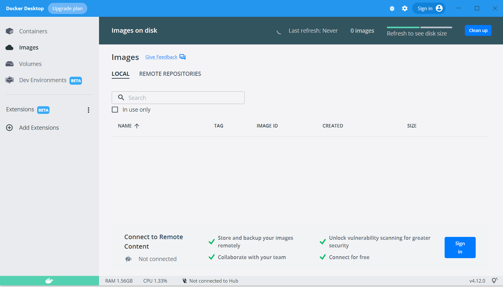
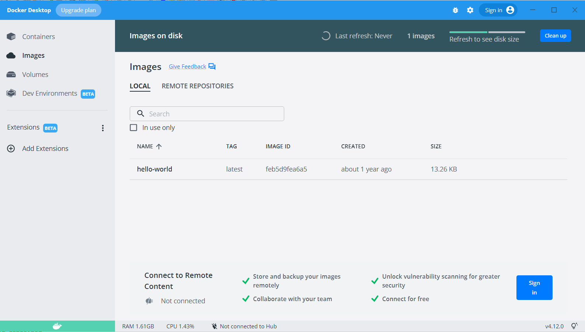
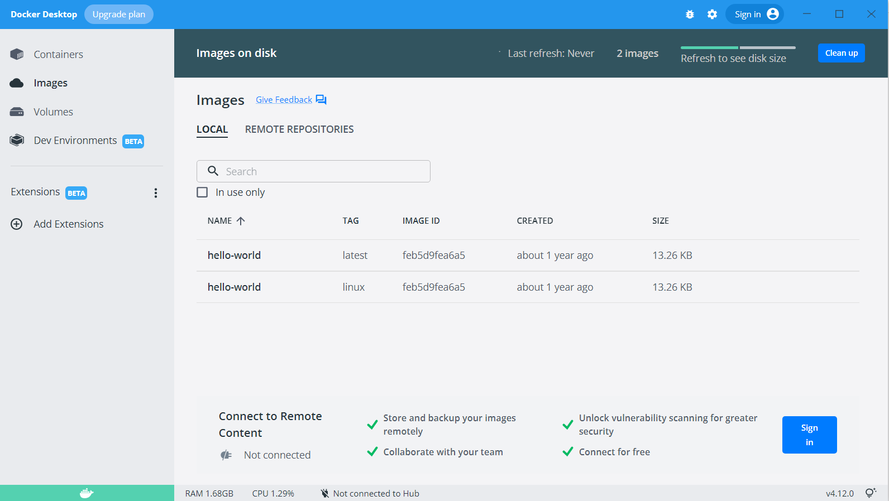
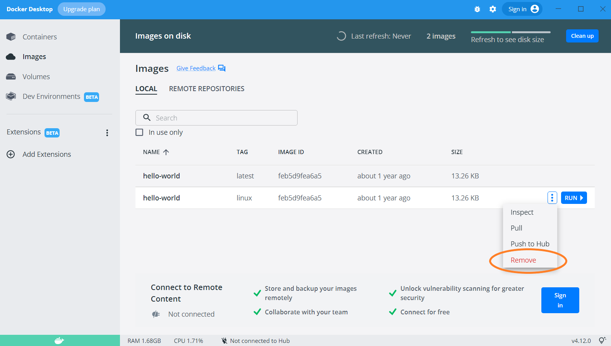
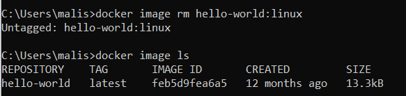

# Partie 1: premiers pas avec Docker   

## Pourquoi Docker?  
**"Mais pourtant ça marche chez moi!"**  
On a tous rencontré ce problème en travaillant sur un projet à plusieurs. Le fameux projet qui fonctionne bien chez une personne et pas chez une autre.
Le projet qui fonctionne en mode "développement" et qui ne fonctionne plus en mode "production".

  

Et si on livrait plus que du code? Et si on livrait tout un package pour lancer notre application facilement? 
   

## Présentation de Docker Desktop  
Docker est un outil qui permet de lancer un processus sur votre machine de façon isolée, dans un *conteneur*.    
Il peut être créé, démarré, arrêté, déplacé d'un environnement à un autre ou supprimé grâce à la CLI Docker.  
Un conteneur peut être lancé sur une machine locale mais aussi sur une machine virtuelle ou déployé dans le cloud, ce qui offre une grande flexibilité.    
Chaque conteneur est isolé des potentiels autres conteneurs et fait tourner ses propres logiciels, binaires et ses propres configurations.  

Un conteneur est une instance executable d'une *image*.
Une image Docker fournit le système de fichier dédié pour le conteneur.  
L'image doit donc avoir tout ce dont le conteneur aura besoin pour fonctionner : 
* dépendances 
* configuration
* scripts 
* binaires
* variables d'environnement
* commandes par défaut à executer
* ...  

Cette image peut être stockée localement ou sur le DockerHub, et elle peut posséder un tag.  
Enfin, Docker peut tourner sur n'importe quelle OS.

  
**-----!!INSERT SCHEMA HERE!!-----**

## Commandes de base
**ATTENTION REVOIR ET UNIFIER LE VOTRE MACHINE / MA MACHINE, LE ON/VOUS/NOUS**   
Voyons ici quelques commandes basiques que nous allons réutiliser tout le long du cours.  
Cette liste est loin d'être exhaustive, n'hésitez pas à consulter la [documentation Docker](https://docs.docker.com/) pour découvrir toutes les commandes qui sont à votre disposition!

Nous allons tester plusieurs de ces commandes avec l'image *helloworld* de Docker. Nous allons les présenter sous deux formats : en ligne de commande et via le Docker Desktop. A la fin de ce module vous pourrez choisir ce quivous convient le mieux au quotidien.  

  
### docker image 
Commençons avec des commandes concernant la gestion des images. 
#### docker image ls  

`docker image ls` permet de lister les images présentes sur votre Docker local.  
Lorsque vous lancez une image, le daemon Docker va rechercher l'image sur votre machine en premier. Si elle ne s'y trouve pas elle va la récupérer sur le DockerHub.  
  
Lancez la commande une première fois : si vous n'avez encore rien lancé sur votre Docker la liste des images locales devrait être vide.  
   
   
 
Maintenant, récupérez l'image hello-world, sans toutefois lancer le container, grâce à la commande `docker pull hello-world` .

  

Listez à nouveau les conteneurs locaux : vous devrier voir apparaitre hello-world dans votre liste. 
   
  

Pour réaliser cette opération avec le Docker Desktop, il vous suffirait de rentrer le nom de l'image dans la barre de recherche.
  
**Avez-vous remarquez le tag associé à notre image?**  
Et oui, si vous ne spécifiez pas de tag en particulier, Docker récupère par défaut le tag *latest* c'est à dire la dernière version de l'image. Comment faire pour récupérer un tag en particulier?  
Les commandes Docker sont assez intuitives, il vous suffit de spécifier le <tag> ainsi : `docker pull hello-world:<tag>` .  

Récupérer l'image hello-world avec le tag `linux` , si vous listez à nouveau les images locales vous devez voir à présent l'image hello-world sous deux tags différents.  
   

####docker image rm 
`docker image rm` 
Nous avons maintenant deux images hello-world avec deux tags différents sur notre machine. Nous allons en garder une seule pour plus de simplicité. 
Pour supprimer une image stockée en local, vous pouvez utiliser le Docker Desktop ou bien saisir la commande `docker image rm <image>:<tag>` .  
Supprimez l'image hello-world qui possède le tag `linux`, pour ne garder que la `latest` . Vérifiez en listant les images restantes en local.  

   
   

**Avez-vous remarqué l'image ID?**
Parfois les noms des images sont complexes et donc sources d'erreur lors de la saisie en ligne de commande. Chaque image a un identifiant associé, et nous pouvons donc remplacer le nom de l'image par son image ID. 
Vous le trouvez lui aussi trop long? Sachez qu'il suffit de saisir les premieres hexadécimales, si c'est assez éloquant le deamon trouvera l'image correspondante! 
Attention, dans notre cas nous avions deux fois la même image, avec le même ID, ce qui va poser un problème de conflit au deamon. **A DEPLACER PLUS TARD QUAND PLUSIEURS IMAGES DIFFERENTES**   

`docker image prune`
Cette commande permet de faire table rase et de supprimer toutes les images locales orphelines, c'est-à-dire qui n'ont pas de tag ou de conteneur associé.  
C'est une commande utile quand on n'a pas ouvert Docker pendant quelques temps et qu'on faire un peu de nettoyage!
Si vous souhaitez supprimer toutes les images inutilisées (et pas seulement les orphelines), il suffit d'ajouter l'option `-a` ou `--all` . Cette commande supprimera **tous** les conteneurs qui ne sont pas utilisés.  

   
`docker image build`  
Cette commande va nous permettre de créer une image Docker de toute pièce. Nous la verrons dans la suite de ce cours, un peu de patience! 
Retenez juste qu'elle va s'écrire sous cette forme : ` docker image build [OPTIONS] PATH | URL | -`   

### docker container
`docker container ls` ou `docker ps` ou `docker ps -a`  
`docker container exec`  
`docker container kill`  
`docker container logs`  
`docker container prune`  
`docker container restart`  
`docker container rm`  
`docker container run`  
`docker container start`  
`docker container stop`  

### docker run
`docker run [OPTIONS] IMAGE [COMMAND] [ARG...]`  

`--detach`, `-d`  
`--name`  
`--publish`, `-p`  
`--user`, `-u`  